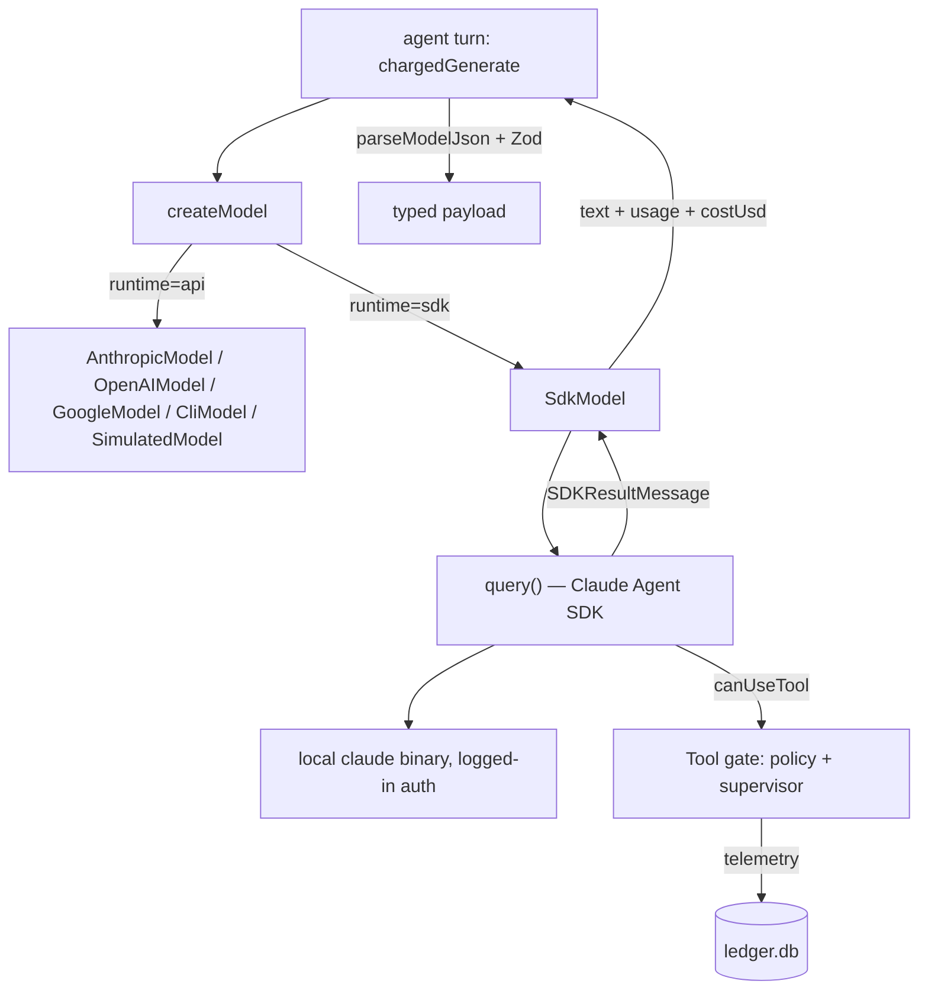

# Design: Claude Code Runtime

Port agent-verse to run completely locally on Claude Code via the Claude Agent
SDK. Each of the four agents (Idea, CEO, Operator, Monitor) executes as a
tool-enabled Claude Code session. The state machine, Zod schemas, SQLite
ledger, and company brain are preserved unchanged.

## Canonical Vocabulary

| Term | Definition |
|------|-----------|
| **Runtime** | The execution backend for an agent turn. Two values: `api` (existing `Model.generate` providers — Anthropic/OpenAI/Google/Ollama/CLI/simulated) and `sdk` (Claude Agent SDK `query()` sessions). |
| **SdkModel** | New provider implementing the existing `Model` interface (`src/llm/index.ts:46`) on top of `@anthropic-ai/claude-agent-sdk`'s `query()`. Provider type string: `sdk`. |
| **Agent turn** | One invocation of an agent: system instruction + prompt in, validated JSON out. Under the `api` runtime this is one completion; under the `sdk` runtime it is one full Claude Code session (multi-turn tool use internally, single result out). |
| **Session context** | Per-turn execution scope passed to `SdkModel`: working directory (`cwd`), allowed tools, turn cap, budget cap, and the tool gate. Carried on `LlmRequestOptions.session`. |
| **Tool gate** | The SDK's `canUseTool` callback wired to the existing policy/supervisor logic. Enforces per-tool-call risk decisions live, replacing the advisory pre-execution policy prompt for `sdk`-runtime operator turns. |
| **Company dir** | `companies/<company_id>/` — the brain directory. Under the `sdk` runtime it is also each agent session's `cwd`, making file state the inter-agent communication surface. |
| **Auto-fallback** | Runtime selection rule at startup: explicit flag/env wins; otherwise if `ANTHROPIC_API_KEY` is absent and the `claude` binary is on `PATH`, select the `sdk` runtime. |
| **Actual cost** | `total_cost_usd` reported by the SDK result message. Preferred over the `pricing.ts` token-based estimate when present. |
| **L2 gate** | The existing Layer-2 risk step of the operator's 5-layer loop (`src/agents/operator.ts`): policy check plus supervisor escalation. Under the `sdk` runtime it is realized as the tool gate. |

## Decisions

### Runtime mechanism: Claude Agent SDK, behind the existing Model interface
**Decision:** Add `@anthropic-ai/claude-agent-sdk` as a dependency and implement
`SdkModel implements Model` in `src/llm/sdk.ts`. `generate(system, prompt,
options)` maps to one `query()` call; the final `SDKResultMessage.result`
string is returned as `GenerateResult.text`.
**Rationale:** The `Model` interface is the single seam every agent already
goes through (`chargedGenerate` in `src/agents/operator.ts:45`, similar in
idea/ceo/monitor/supervisor). Implementing the SDK behind it keeps `graph.ts`,
`schemas.ts`, `ledger.ts`, `companyBrain.ts`, and the test suite intact.
**Alternatives considered:** (a) Subprocess `claude -p` provider — loses native
sub-agent/tool/permission control and structured cost reporting; the existing
`CliModel` already covers the crude version. (b) Rewriting `graph.ts` on SDK
sub-agents (`options.agents`) — discards the working state machine and test
suite for no behavioral gain; explicitly rejected since the state machine is a
keep requirement.

**Contract additions (explicit types):**

```typescript
// src/llm/index.ts — extensions, both optional so api providers are untouched
interface SessionContext {
  cwd: string;
  allowedTools: string[];
  maxTurns: number;
  maxBudgetUsd?: number;
  canUseTool?: CanUseTool;        // SDK callback type; wired by operator turns
}
interface LlmRequestOptions { /* existing fields */ session?: SessionContext; }
interface GenerateResult     { /* existing fields */ costUsd?: number; }
```

`session` is meaningful only to `SdkModel`; other providers ignore it (same
pattern as the existing `fixtureKey`).

### Both runtimes coexist
**Decision:** Keep `src/llm/` providers as-is. Add provider type `'sdk'` to
`LlmProviderType`. Selection: `--runtime sdk|api` CLI flag / `AGENT_RUNTIME`
env var, plus auto-fallback. `detectProvider` and `createModel` are extended,
not replaced.
**Rationale:** Non-Claude models (`gpt-4o-mini`, `gemini-2.5-flash`, Ollama)
remain usable text-only; the simulated provider keeps powering deterministic
e2e tests. The SDK path is additive.
**Alternatives considered:** SDK-only (deletes multi-provider support and the
deterministic test path); SDK + simulated only (drops multi-cloud for no
size win — the providers are small and tested).

### All agents get tools; scope is the company dir
**Decision:** Every agent turn under the `sdk` runtime runs with tools enabled:
- **Idea-Agent:** `cwd` = companies root; tools `Read, Glob, Grep` (survey
  existing ventures; produces JSON only).
- **CEO-Agent:** `cwd` = companies root; tools `Read, Write, Glob` (may
  scaffold files under the new company dir; brain files are still written by
  `companyBrain.ts` as the canonical path).
- **Operator-Agents:** `cwd` = company dir; tools `Read, Write, Edit, Bash,
  Glob, Grep` (engineering can produce real artifact files in the company
  dir).
- **Monitor-Agent:** `cwd` = company dir; tools `Read, Glob, Grep` (reads
  task logs/artifacts; ledger queries stay in TypeScript).
All sessions: `permissionMode: 'dontAsk'`, `persistSession: false` (stateless;
the company brain is the memory), `maxTurns` capped (default 10 for operators,
4 for the others), `maxBudgetUsd` set from the venture's remaining budget.
**Rationale:** Tool access is the point of moving to Claude Code — operators
stop emitting "deliverable" strings describing files and start writing the
files. Idea/CEO/Monitor get read-mostly scopes because their outputs are
decisions, not artifacts.

### Tool gate: canUseTool hosts policy + supervisor
**Decision:** For `sdk`-runtime operator turns, the L2 risk gate moves into
the SDK's `canUseTool` callback:
1. Tools in the agent's read-only set (`Read`, `Glob`, `Grep`) → allow.
2. `Write`/`Edit` targeting paths inside the company dir → allow; outside →
   deny with reason.
3. `Bash` and any other tool → classify risk with the existing policy logic;
   `high`/`critical` → `supervisor.evaluate()`; supervisor `halt` → deny and
   mark the task `halted`; `pass`/`mitigate` → allow.
4. Every gate decision is recorded to the ledger as telemetry
   (`layer: 'tool_gate'`).
Budget enforcement is structural: `maxBudgetUsd` on the session, with the
SDK's `error_max_budget_usd` result subtype mapped to task `blocked` with a
budget-exceeded error. The pre-execution policy prompt
(`policyCheck` in `operator.ts`) is skipped on the `sdk` runtime — the gate
subsumes it. The `api` runtime keeps the existing prompt-based L2 unchanged.
**Rationale:** Enforcement in code beats instruction in prose (repo principle:
"Enforce, do not instruct"). A live per-call gate is strictly stronger than a
one-shot advisory check, and the supervisor escalation path is reused, not
reimplemented.
**Alternatives considered:** `bypassPermissions` + advisory pre-check (gate
not enforced); static allowlists only (loses risk-adaptive escalation and the
supervisor's mitigate path).

### Inter-agent communication stays file + state based
**Decision:** No change to the communication model. Typed payloads
(`VenturePayload`, `OperatorTask`, `MonitorReport`) continue to flow through
`graph.ts` in memory; durable state flows through the company brain
(`context_framework.json`, `skills.md`, `task_log.jsonl`) and the ledger.
SDK sessions see the brain because their `cwd` is the company dir.
**Rationale:** This was a keep requirement; the SDK's filesystem tools make
the existing file conventions directly legible to each session without new
plumbing.

### Structured output: keep prompt-schema + Zod parse
**Decision:** `sdk`-runtime turns keep using `withJsonSchema` system prompts;
the result text goes through the existing `parseModelJson` → Zod `parse`
pipeline. The SDK's native structured-output option is deferred.
**Rationale:** One validation pipeline for both runtimes; zero changes to
agents' parsing code. Revisit if JSON breakage is observed in practice.

### Cost accounting: prefer actual cost
**Decision:** Extend `GenerateResult` with optional `costUsd`. `SdkModel`
populates it from `SDKResultMessage.total_cost_usd`; `chargedGenerate` (and
its siblings) charge `costUsd` when present, falling back to the
`estimateCostUsd` token estimate otherwise.
**Rationale:** The SDK reports ground-truth spend — better than estimation.
Optional field keeps every other provider untouched.

### Runtime selection and auth
**Decision:** Resolution order for the runtime:
1. `--runtime sdk|api` CLI flag, else `AGENT_RUNTIME` env var.
2. Auto-fallback: no `ANTHROPIC_API_KEY` set **and** `claude` found on `PATH`
   → `sdk`.
3. Default: `api` (current behavior).
Under the `sdk` runtime, `checkCredentials` does not require
`ANTHROPIC_API_KEY` — the SDK uses the local Claude Code login. The model id
(`AGENT_MODEL`/`--model`, default `claude-sonnet-4-6`) is passed through to
`query({options: {model}})`.
**Rationale:** `npm start` just works on a machine with Claude Code installed
and no API keys; explicit choice always wins.

### Testing: mock the SDK boundary
**Decision:** Unit tests `vi.mock('@anthropic-ai/claude-agent-sdk')` and
assert on the options `SdkModel` constructs (model, cwd, allowedTools,
permissionMode, maxBudgetUsd) and on result handling (text extraction, cost
propagation, error subtypes → task statuses, canUseTool decisions). The
simulated provider keeps covering the e2e graph loop. A real-CLI smoke test is
opt-in via env var, extending the existing `CLI_AGENT_CMD` pattern
(`src/__tests__/cli-agent.smoke.test.ts`).
**Rationale:** The user chose mock-at-spawn-level; with the SDK the spawn is
internal to `query()`, so the SDK module boundary is the equivalent seam. No
`claude` install needed in CI.

### Callable units
**Decision:** No new tool/script/skill/bin unit. The feature is source code
(`src/llm/sdk.ts`, edits to `src/llm/index.ts`, `src/agents/operator.ts`,
`src/cliArgs.ts`, `src/main.ts`) plus one new npm dependency. The existing
`npm start -- --runtime sdk` surface covers invocation.
**Rationale:** Per `docs/agent-authoring-requirements.md` §1 there is no new
calling surface; adding one speculatively is forbidden.

## Visualizations

### Runtime dispatch



### Operator turn under the sdk runtime

```mermaid
sequenceDiagram
    participant O as operator.run()
    participant M as SdkModel
    participant S as Claude Code session
    participant G as Tool gate (canUseTool)
    participant B as company dir / brain

    O->>M: generate(system, task, {session: cwd, tools, budget})
    M->>S: query({prompt, options})
    loop tool use
        S->>G: tool call (e.g. Write artifact.md)
        G->>G: risk classify; escalate if high/critical
        G-->>S: allow / deny(reason)
        S->>B: read/write files in company dir
    end
    S-->>M: SDKResultMessage {result, usage, total_cost_usd}
    M-->>O: {text, usage, costUsd}
    O->>O: Zod-validate ToolOutput, quality gate, telemetry
```

## Edge Cases & Scenarios

- **Scenario:** `--runtime sdk` but `claude` binary missing → expected: startup
  error naming the binary and the install hint; exit non-zero (mirrors
  `checkCredentials`).
- **Scenario:** Session hits `maxTurns` (`error_max_turns`) → expected: task
  `failed` with error `"SDK session exceeded N turns"`; telemetry recorded.
- **Scenario:** Session hits `maxBudgetUsd` (`error_max_budget_usd`) →
  expected: task `blocked` with budget-exceeded error; consumed cost still
  charged to the venture from `total_cost_usd`.
- **Scenario:** Tool gate denies a Write outside the company dir → expected:
  session continues (deny is per-call); telemetry entry
  `layer: 'tool_gate', success: false`; if the session ends without valid JSON
  the quality gate fails it as today.
- **Scenario:** Supervisor unavailable during a gate escalation → expected:
  fail closed — deny the tool call (matches `applyPolicy`'s both-gates-down
  behavior).
- **Scenario:** Result text is prose, not JSON → expected: existing
  `parseModelJson` throws, task `failed` via the existing L3 error path. No
  new handling.
- **Scenario:** `--model gpt-4o-mini --runtime sdk` → expected: startup error —
  the sdk runtime is Claude-only; suggest dropping `--runtime sdk` or choosing
  a Claude model.
- **Scenario:** Auto-fallback ambiguity — `ANTHROPIC_API_KEY` set *and*
  `claude` on PATH → expected: `api` runtime (explicit key signals API
  intent); print the selected runtime at startup either way.
- **Scenario:** Two operator sessions write the same brain file concurrently →
  expected: unchanged from today — operators own role-disjoint outputs;
  `task_log.jsonl` appends happen in TypeScript after the session, not inside
  it.

## Q&A Summary

**Q:** Which runtime mechanism — subprocess `claude -p`, Agent SDK, or reuse
`CliModel`?
**A:** Agent SDK rewrite (user chose the fuller option over the recommended
subprocess provider). Scoped to: SDK behind the existing `Model` interface,
state machine untouched.

**Q:** Tool access for agents?
**A:** All agents get tools (user chose over operators-only). Read-mostly
scopes for Idea/CEO/Monitor; full file/bash scope inside the company dir for
operators.

**Q:** Auto-select the local runtime when no API key is present but `claude`
is installed?
**A:** Yes — auto-fallback, explicit flags always win.

**Q:** Test strategy without a CI `claude` install?
**A:** Mock at the SDK module boundary (`vi.mock`), keep simulated-provider
e2e, opt-in real smoke test.

**Q:** Fate of the multi-provider layer?
**A:** Keep both runtimes; `sdk` is additive, `api` remains for non-Claude
models and deterministic tests.

**Q:** How do permissions and the risk gate work in SDK sessions?
**A:** `canUseTool` hosts the gate: static allows for read-only tools,
path-scoped allows for writes, policy+supervisor escalation for bash/high
risk, ledger telemetry for every decision, fail closed.
