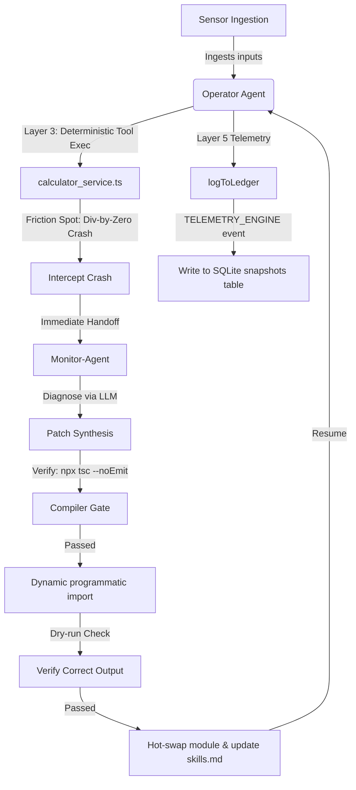

# Design — Deterministic Time-Travel Playback & Self-Healing (`time-travel-replay`)

This document defines the architectural guidelines, canonical vocabulary, and key design decisions for implementing the **Deterministic Time-Travel Playback Engine** and the **Compiler-Gated Self-Healing Loop** in the `agent_verse` TypeScript ecosystem.

---

## 1. Goal

Establish perfect simulation visibility for human supervisors and provide resilient self-healing capabilities when software crashes are encountered. Supervisors can visually play, pause, reverse, and fast-forward simulated corporate steps via a dynamic glassmorphic web dashboard, while the `Monitor-Agent` intercepts bugs, compiles/verifies candidate TypeScript patches in-process, and hot-swaps them at runtime.

---

## 2. Canonical Vocabulary

| Term | Meaning |
| :--- | :--- |
| `SimulationSnapshot` | A full state model record representing one step index of execution (Git SHA, input stimulus, context state, and output result). |
| `snapshots table` | The consolidated SQLite table inside `ledger.db` where all `SimulationSnapshot` records are immutably written. |
| `Playback Console` | The visual user interface card enabling timeline scrubbing, step jumping, play/pause, and fast-forward. |
| `Deterministic Services` | Software modules (`calculator_service.ts` and `payment_service.ts`) used as tools by operator agents. |
| `Immediate Self-Healing` | An execution graph transition where a tool crash immediately hands control to the `Monitor-Agent` rather than waiting for the cycle to end. |
| `Compiler Gate` | Running `npx tsc --noEmit` on synthesized patches before letting them execute to guarantee type safety. |
| `Programmatic Dry-Run` | Programmatically loading a candidate patch via URL-parameter cache-busted dynamic imports and executing validation checks in-process. |

---

## 3. Design Q&A & Decisions

### Q1: Simulation Snapshot Storage
**Decision:** Consolidated SQLite Storage.
* Snapshots are written to a dedicated `snapshots` table inside `companies/ledger.db`.
* **Rationale:** Consolidates all system states into a single transactionally safe, total legibility database instance, matching our SQLite philosophy while remaining queryable via history REST APIs.

### Q2: Self-Healing Transition Flow
**Decision:** Immediate Self-Healing Transition.
* **Flow:** SENSOR $\rightarrow$ POLICY $\rightarrow$ TOOL (Crash!) $\rightarrow$ Intercept $\rightarrow$ MONITOR AGENT (Fix $\rightarrow$ Compiler Gate $\rightarrow$ Dry-Run $\rightarrow$ Hot-Swap) $\rightarrow$ Operator Retry.
* **Rationale:** Prevents corrupted execution states from propagating and provides the highest-quality self-healing pipeline where failures are corrected on the fly.

### Q3: Dynamic Healed-Patch Verification
**Decision:** Programmatic Dry-Run.
* **Method:** Run `npx tsc --noEmit` as a compiler check. On success, programmatically import the healed calculator module using `await import("./calculator_service.js?update=" + Date.now())` and run a dry-run check with a crashing input to assert a successful return.
* **Rationale:** Incredibly fast execution (< 5ms) and avoids the subprocess overhead of a complete Vitest suite run while guaranteeing absolute compilation safety.

---

## 4. Architecture & Topology

---

## 5. Next Steps
Move to the **PRD Phase** (`prd.md`) to define the precise JSON schemas, WebSocket protocols, and REST API structures.
